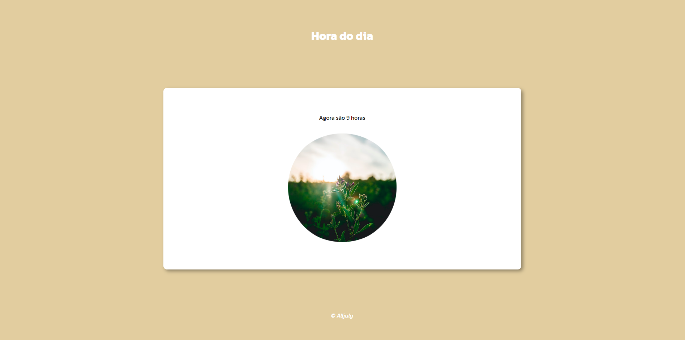
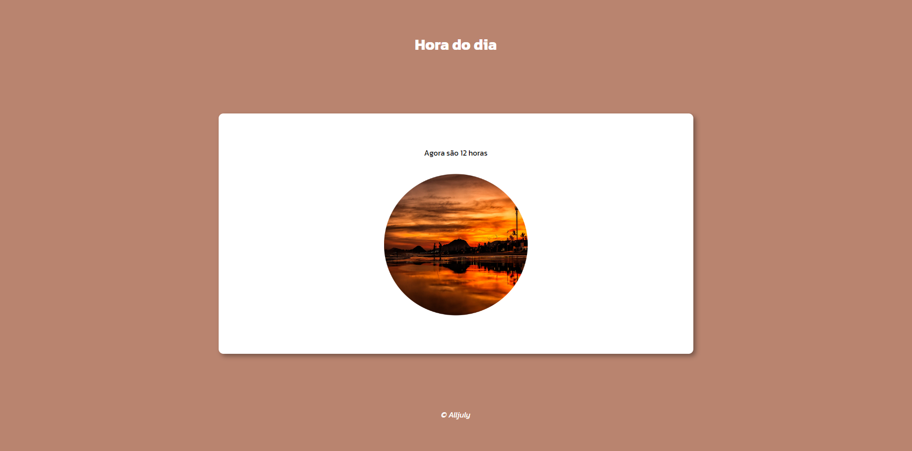

# 🕰️ Relógio Digital

### Uma aplicação simples utilizada para a primeira avaliação de Introdução às Tecnologias Web do curso de Sistemas de Informação

### Vizualização pela manhã

### Vizualização pela tarde

### Vizualização pela noite

